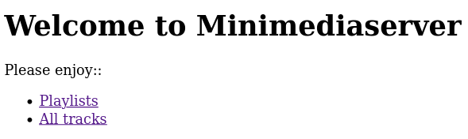
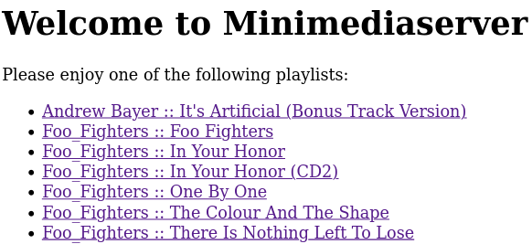
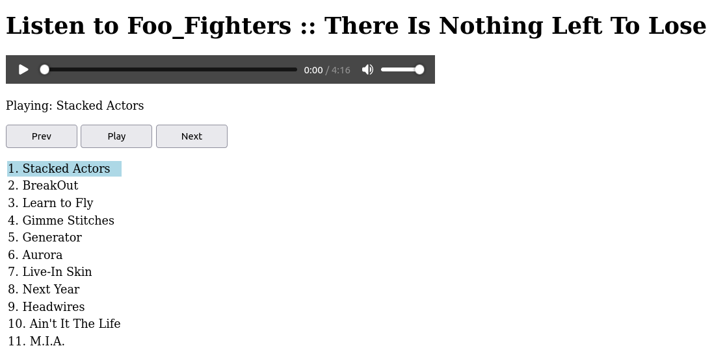

# minimediaserver

## Overview

A mini media server, which provides a web interface for browsing and listening to your music.

`example-config.json` is a basic example configuration. Copy it to `$HOME/.minimediaserver.json` for it to be used by the media server.

E.g.: with a config like this:

```json
{
	"host": "*",
	"port":	"1337",

	"storageServices": [
		{
			"type": "nullStorage"
		},
		{
			"type": "diskStorage",
			"path": "$HOME/Music/cds"
		}
	]
}
```

It can easily read a music library with a layout shown below. More complex libraries may need additional configuration (see later section on configuration).

```bash
$ find ~/Music/cds | grep -i foo_fighters
/home/username/Music/cds/Foo_Fighters
/home/username/Music/cds/Foo_Fighters/Foo_Fighters
/home/username/Music/cds/Foo_Fighters/Foo_Fighters/01.This_Is_a_Call.flac
/home/username/Music/cds/Foo_Fighters/Foo_Fighters/12.Exhausted.flac
/home/username/Music/cds/Foo_Fighters/Foo_Fighters/09.For_All_The_Cows.flac
/home/username/Music/cds/Foo_Fighters/Foo_Fighters/08.Oh,_George.flac
/home/username/Music/cds/Foo_Fighters/Foo_Fighters/11.Wattershed.flac
/home/username/Music/cds/Foo_Fighters/Foo_Fighters/02.Ill_Stick_Around.flac
/home/username/Music/cds/Foo_Fighters/Foo_Fighters/Foo_Fighters.m3u
/home/username/Music/cds/Foo_Fighters/Foo_Fighters/06.Floaty.flac
/home/username/Music/cds/Foo_Fighters/Foo_Fighters/05.Good_Grief.flac
/home/username/Music/cds/Foo_Fighters/Foo_Fighters/04.Alone+Easy_Target.flac
/home/username/Music/cds/Foo_Fighters/Foo_Fighters/03.Big_Me.flac
/home/username/Music/cds/Foo_Fighters/Foo_Fighters/07.Weenie_Beenie.flac
/home/username/Music/cds/Foo_Fighters/Foo_Fighters/10.X-Static.flac
/home/username/Music/cds/Foo_Fighters/There_Is_Nothing_Left_To_Lose
/home/username/Music/cds/Foo_Fighters/There_Is_Nothing_Left_To_Lose/08.Next_Year.flac
/home/username/Music/cds/Foo_Fighters/There_Is_Nothing_Left_To_Lose/01.Stacked_Actors.flac
/home/username/Music/cds/Foo_Fighters/There_Is_Nothing_Left_To_Lose/05.Generator.flac
/home/username/Music/cds/Foo_Fighters/There_Is_Nothing_Left_To_Lose/11.M.I.A..flac
/home/username/Music/cds/Foo_Fighters/There_Is_Nothing_Left_To_Lose/There_Is_Nothing_Left_To_Lose.m3u
/home/username/Music/cds/Foo_Fighters/There_Is_Nothing_Left_To_Lose/10.Aint_It_The_Life.flac
/home/username/Music/cds/Foo_Fighters/There_Is_Nothing_Left_To_Lose/02.BreakOut.flac
/home/username/Music/cds/Foo_Fighters/There_Is_Nothing_Left_To_Lose/04.Gimme_Stitches.flac
/home/username/Music/cds/Foo_Fighters/There_Is_Nothing_Left_To_Lose/03.Learn_to_Fly.flac
/home/username/Music/cds/Foo_Fighters/There_Is_Nothing_Left_To_Lose/07.Live-In_Skin.flac
/home/username/Music/cds/Foo_Fighters/There_Is_Nothing_Left_To_Lose/09.Headwires.flac
/home/username/Music/cds/Foo_Fighters/There_Is_Nothing_Left_To_Lose/06.Aurora.flac
...
```

## Building and Running the Server

You need to have `go` and `make` installed.

You will need to set up a configuration file first. Adapt the simple example shown in the Overview, or read the section below on the configuration file format for more details.

Now, you can start the server using:

```bash
make
./bin/minimediaserver
```

## Using the Web Music Player

Once the server has been started, you can access it on [http://127.0.0.1:1337/]([http://127.0.0.1:1337/). You should see something like:



Click on the playlists link, and it should show you a list of your albums. E.g.:



Click on an album, and it will take you to a music player for that album. E.g.:



## Hotkeys

The media player has some hotkeys. These only work when the media player tab has focus.

|Key|Function|
|---|---|
|Space|Play/pause|
|,|Previous track|
|.|Next track|
|<|Rewind 15 seconds|
|>|Fast-forward 15 seconds|

## Configuring the Server

minimediaserver supports different storage backends:

 * `diskStorage` - for music files stored on disk.
 * `nullStorage` - mostly for testing, with embedded audio file.

It is possible to configure multiple instances of each storage backend.

minimediaserver should work out of the box with libraries where artists and albums are separated into directories. E.g.: the tracks for an album can be found in `/path/to/music/artist/album`. It should also work well if you have a lot of tagged music, and the server can group tracks into albums using the tags. If there are no tags, then it is possible to group tracks using regular expressions, but that requires more work from the user (please see later section on regexps).

The currently supported file formats are:

 * FLAC
 * Ogg
 * MP3
 * M4A

ID3 and Vorbis tags will be used where possible, to find out album, artist, title, etc. information for a music file, and determine which album a track belongs to. See [the playlist design](doc/playlist-design.md) if you are interested in the internals.

For a simple library, your `$HOME/.minimediaserver.json` may only need one storage backend. E.g.: for an iTunes library:

```json
{
        "host": "*",
        "port": "1337",

        "storageServices": [
                {
                        "type": "diskStorage",
                        "path": "$HOME/Music/iTunes/iTunes Media/Music"
                }
        ]
}
```

If you also have some FLAC files that you've generated from CDs that you own, you may want to add that too, e.g.:

```json
{
        "host": "*",
        "port": "1337",

        "storageServices": [
                {
                        "type": "diskStorage",
                        "path": "$HOME/Music/iTunes/iTunes Media/Music"
                },
				{
						"type": "diskStorage",
						"path": "$HOME/Music/cds"
				}
		]
}
```

### Grouping Tracks Using Regular Expressions

Author notes: This may be a very specific use-case for my MP3 library.

If you generated MP3s from your CDs a long time ago, then they may not have tags, and you may have used a flat directory format. In that case you may have a directory containing a lot of MP3s with the artist, album, track, etc. information encoded in the filename. E.g.:

```
adam f - colours (08) - circles.mp3

botchit & scarper - botchit breaks (disc 01) (07) - full moon scientist - we demand a shrubbery (scissorkicks mix).mp3
```

minimediaserver supports extracting artist, album, track, etc. information from filenames using regular expressions. The configuration can include a list of regexps to use for a given storage backend. The regexps will be matched in the order they appear in the configuration file, so list them from most to least specific.

So for the example MP3 names above, we would want to be able to generate a playlist for:

 * Artist: adam f, Album: colours, Track number: 8, Title: circles (plus other tracks)
 * Album artist: botchit & scarper, Album: botchit breaks (disc 01), Track number: 7, Track artist: full moon scientist, Title: we demand a shrubbery (scissorkicks mix)

Here is an example configuration that will match the example MP3 names above:

```json
{
	"host": "*",
	"port":	"1337",

	"storageServices": [
		{
			"type": "diskStorage",
			"path": "$HOME/Music/mp3",
			"regexps": [
				"(?P<albumartist>.+) - (?P<album>.+) \\((?P<trackno>\\d+)\\) - (?P<artist>.+) - (?P<title>.+)",
				"(?P<artist>.+) - (?P<album>.+) \\((?P<trackno>\\d+)\\) - (?P<title>.+)"
			]
		}
	]
}
```

This is definitely a power-user feature. It uses [named captures](https://github.com/google/re2/wiki/Syntax). Named captures are used to make it possible to match the fields in any order, and tell minimediaserver what each field means.

Breaking down the example above: `(?P<albumartist>.+)` means match any number of characters ("`.+`"), group them (the brackets around it), store in the named capture `albumartist` ("`?P<albumartist>`"). `.+` will capture characters up to the first occurrence of "` - `". And so on through the regular expression. Note that backslashes need to be escaped. "`\\(`" and "`\\)`" in the regular expression are actually matching brackets. This is needed because brackets are used to denote captures.

If you are writing your own regexp, make sure to use the right names in the named captures, otherwise the matches will be lost.